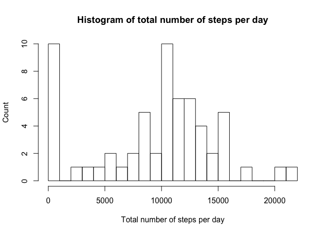
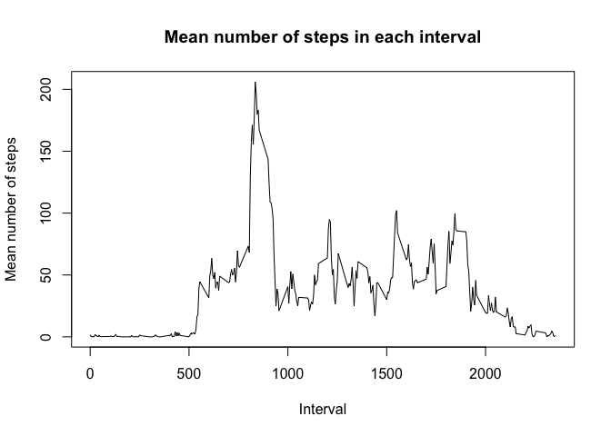
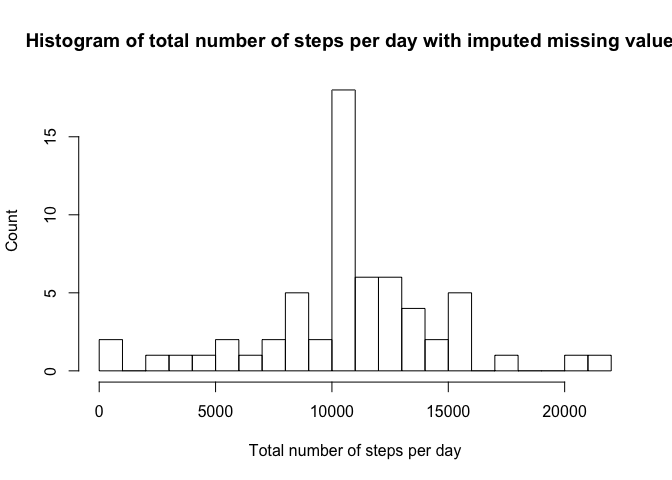
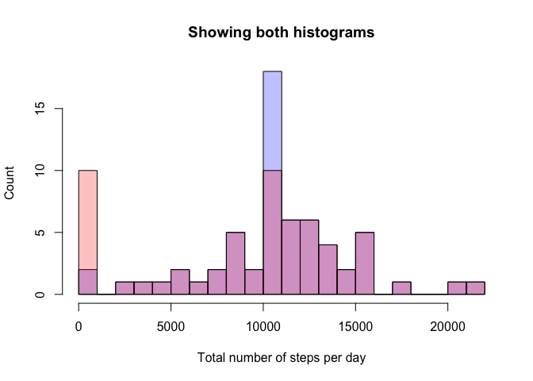
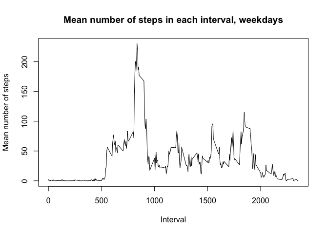
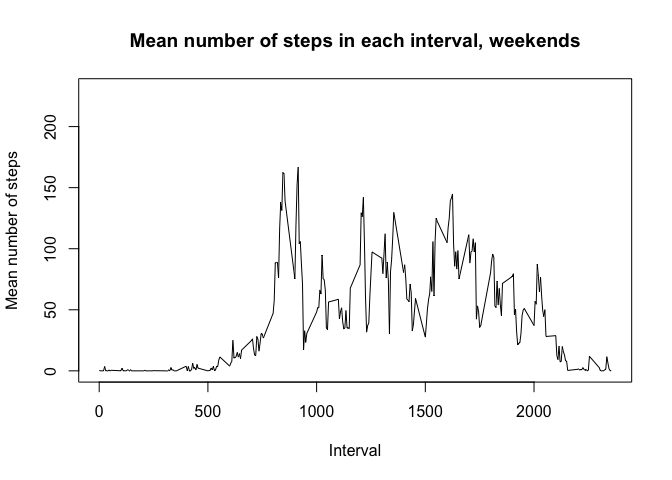

#### Read the data


```r
datafile = 'activity.csv'
d<-read.csv(datafile, header = TRUE)
```

#### Make an histogram of the total number of steps per date
#### Missing values are excluded


```r
t<-tapply(d$steps, d$date, sum, na.rm=TRUE)
hist(t, breaks = 20, freq = TRUE,
     main='Histogram of total number of steps per day',
     xlab='Total number of steps per day',
     ylab='Count')
```

<!-- -->

#### Print mean and median of total number of steps per day
#### Missing values are excluded

```r
print(paste('Mean number of steps per day',
            mean(d$steps, na.rm = TRUE)))
```

```
## [1] "Mean number of steps per day 37.3825995807128"
```

```r
print(paste('Median number of steps per day',
            median(d$steps, na.rm = TRUE)))
```

```
## [1] "Median number of steps per day 0"
```

#### Print the graph of the mean number of steps in each time interval
#### Missing values are excluded

```r
t<-tapply(d$steps, d$interval, mean, na.rm=TRUE)
plot(unique(d$interval), t, type="l",xlab='Interval',
     ylab='Mean number of steps',
     main='Mean number of steps in each interval')
```

<!-- -->

#### Find the interval that contains the maximum number of steps on average across all days
#### Missing values are excluded

```r
print(t[t==max(t)])
```

```
##      835 
## 206.1698
```

## Imputing missing values

#### How many missing values are there?

```r
print(paste("Number of missing values",
            length(d$steps[is.na(d$steps)==TRUE])))
```

```
## [1] "Number of missing values 2304"
```

#### As missing values use the mean number of steps in each interval

```r
steps<-d$steps
date<-d$date
interval<-d$interval
u<-which(is.na(d$steps))
steps[u]<-t[as.character(d$interval[u])]
new_d<-data.frame(steps, date, interval)
```

#### Check that there are indeed no more missing values in the steps column

```r
a<-is.na(new_d$steps)==TRUE
a[a==TRUE]
```

```
## logical(0)
```

#### Make an histogram of the total number of steps per date
#### Missing values are imputed as decribed above


```r
t<-tapply(new_d$steps, new_d$date, sum, na.rm=TRUE)
hist(t, breaks = 20, freq = TRUE,
     main='Histogram of total number of steps per day with imputed missing values',
     xlab='Total number of steps per day',
     ylab='Count')
```

<!-- -->

#### Imputing the missing values does make a difference: as shown below: the missing values are imputed so the large bar at 0 gets replaced by a bump of the histogram at ~10000 


```r
t<-tapply(new_d$steps, new_d$date, sum, na.rm=TRUE)
p1<-hist(t, breaks = 20, freq = TRUE)
```

```r
t<-tapply(d$steps, d$date, sum, na.rm=TRUE)
p2<-hist(t, breaks = 20, freq = TRUE)
```

```r
plot(p1, col=rgb(0,0,1,1/4),
     main='Showing both histograms',
     xlab='Total number of steps per day',
     ylab='Count') # first histogram
plot(p2, col=rgb(1,0,0,1/4), add=T)  # second
```

<!-- -->

#### Let us try to better understand this


```r
length(unique(d$date[u]))
```

```
## [1] 8
```

```r
length(unique(d$interval[u]))
```

```
## [1] 288
```

```r
length(u)
```

```
## [1] 2304
```

```r
length(unique(d$interval[u]))*length(unique(d$date[u]))
```

```
## [1] 2304
```

```r
sum(new_d$steps[1:length(unique(d$interval))])
```

```
## [1] 10766.19
```

#### The code above shows that:
#### 1. There are 8 days with missing values
#### 2. There are 288 intervals per day
#### 3. There are 2304 missing values
#### 4. 288*8 = 2304

#### So all missing values occur in just 8 days which have no valid values at all

#### If a day does not have any value all its 288 interval are filled with the corresponding mean values, which gives a total number of imputed steps 10766.19; this happens for 8 days and explains the bump at ~10000 steps in the second histogram (from 10 to 18 cases) and the corresponding disappearance (from 10 to 2) of the 8 missing values cases at ~0

#### Find the levels given by the function weekdays

```r
fwd<-factor(weekdays(as.POSIXct(d$date)))
lv<-levels(fwd)
print(lv)
```

```
## [1] "Friday"    "Monday"    "Saturday"  "Sunday"    "Thursday"  "Tuesday"  
## [7] "Wednesday"
```

#### Create the appropriate levels: weekday and weekend

```r
lv<-c("weekday","weekday","weekend","weekend","weekday",
      "weekday","weekday")
fwd2<-factor(weekdays(as.POSIXct(d$date)),labels=lv)
```

#### Separate dataset into weekdays and weekends
#### Use the data with the missing values imputed

```r
q<-fwd2=='weekday'
steps<-new_d$steps[q==TRUE]
date<-new_d$date[q==TRUE]
interval<-new_d$interval[q==TRUE]
new_d_weekday<-data.frame(steps, date, interval)
steps<-new_d$steps[q==FALSE]
date<-new_d$date[q==FALSE]
interval<-new_d$interval[q==FALSE]
new_d_weekend<-data.frame(steps, date, interval)
```

#### Save default plotting option and set plotting
#### options to 2x1 graphs

```r
old.par <- par(mar = c(0, 0, 0, 0))
par(mfrow=c(2,1))
```

#### Plot mean number of steps during each interval
#### for weekdays and weekend separately

```r
t<-tapply(new_d_weekday$steps, new_d_weekday$interval, mean, na.rm=TRUE)
plot(unique(new_d_weekday$interval), t, type="l",xlab='Interval',
     ylab='Mean number of steps',
     main='Mean number of steps in each interval, weekdays',
     ylim=c(0,230))
```

<!-- -->

```r
t<-tapply(new_d_weekend$steps, new_d_weekend$interval, mean, na.rm=TRUE)
plot(unique(new_d_weekend$interval), t, type="l",xlab='Interval',
     ylab='Mean number of steps',
     main='Mean number of steps in each interval, weekends',
     ylim=c(0,230))
```

<!-- -->

#### The plots show that there is a difference in activity patterns between
#### weekdays and weekends: on weekends the subject is more acvtive during
#### the day, especially later in the day, and gets up later and goes to bed later

#### Restore default plotting options

```r
par(old.par)
```


